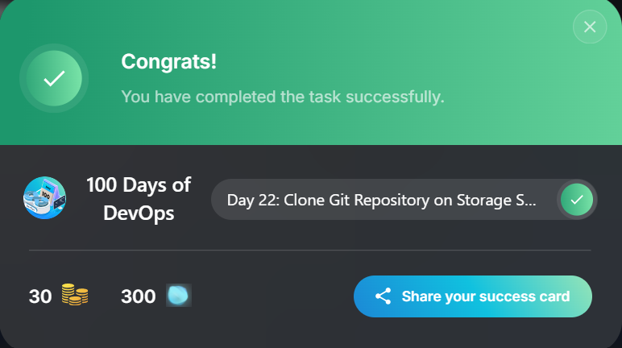

---

# Nautilus Git Repository Clone Task

## 📌 Project Overview

This repository documents the procedure used to **clone an existing Git repository** on the **Storage Server** in the **Stratos Data Center**, as requested by the Nautilus application development team.

The original repository was created earlier but remained unused. The task was to create a **working copy** of this repository in a specified directory **without making any changes** to the repository or system permissions.

---

## 🛠️ Task Requirements

* Source repository location:

  ```
  /opt/games.git
  ```
* Destination directory:

  ```
  /usr/src/kodekloudrepos
  ```
* Task must be performed using the **natasha** user
* No permission changes or unauthorized modifications allowed

---

## ⚙️ Technologies Used

* Git
* Linux (RHEL/CentOS-based system)
* Nautilus / KodeKloud Lab Environment

---

## 🚀 Implementation Steps

### 1️⃣ Switch to the Required User

The task must be executed strictly as the **natasha** user.

```bash
sudo su - natasha
```

---

### 2️⃣ Navigate to the Destination Directory

The repository must be cloned into the existing directory without altering it.

```bash
cd /usr/src/kodekloudrepos
```

---

### 3️⃣ Clone the Git Repository

The repository is cloned using its absolute path.

```bash
git clone /opt/games.git
```

This command creates a working copy of the repository in the destination directory.

---

### 4️⃣ Verify the Clone (Optional Check)

```bash
games

```bash
cd games
git status
```

Expected result:

```
On branch master
nothing to commit, working tree clean
```

---

## 📂 Resulting Directory Structure
```
## 📸 Screenshots

The screenshot below confirms the successful cloning of the repository:

```markdown

```

> Ensure the screenshot file exists in the `screenshots` directory and is committed to the repository.

---

## ✅ Outcome

* Repository successfully cloned from `/opt/games.git`
* Clone stored in `/usr/src/kodekloudrepos`
* Task completed using the `natasha` user
* No permissions or repository data modified

---

## 🧠 Key Notes

* The source repository is a **bare repository**
* Cloning creates a **working directory**
* Using the correct user is mandatory for task validation
* No additional Git operations (pull, push, commit) are required

---

## 👤 Author

**Dr. Musa Bala Audu**
DevOps & Infrastructure Enthusiast

```

